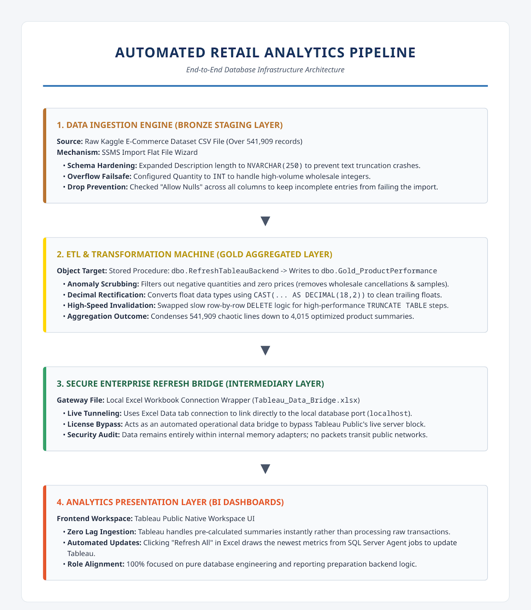

Project Title: Automated E-Commerce Retail Data Pipeline & Reporting Backend

Role Focus: SQL Backend Engineering & Advanced Data Preparation

Target Architecture: Medallion Data Architecture (Bronze to Gold)

Infrastructure Stack: SQL Server Management Studio (SSMS), SQL Server Agent, Microsoft Excel, Tableau Public Presentation Layer

 STEP 1: Business Objective & Architecture Alignment

●	The Problem: Front-end data visualization tools (like Tableau) experience heavy latency, lagging, and rendering timeouts if they are forced to calculate complex business logic, handle millions of messy raw rows, or format floating-point decimals on the fly.

●	The Strategy: Shift all data cleaning, anomaly filtering, and mathematical aggregations away from Tableau and centralize them onto the database engine.

●	The Design: Implement a Medallion Architecture, which isolates data processing into distinct stages:
1. Bronze (Staging Layer): Stores the raw, unaltered source files.
2. Silver (Cleaned Layer):Cleans missing values, handles errors, and standardizes formats.
3. Gold (Aggregated Business Layer): Pre-calculates final business metrics so reporting tools can read them instantly.

STEP 2: Production Ingestion & Schema Hardening (Bronze Layer)

●	The Ingest Stack: Scaled from a basic 4–5 row design concept up to a production-scale Kaggle Online Retail Dataset encompassing **541,909 rows** of transactional data.

●	The Tool Used: SSMS Import Flat File Wizard.

●	Critical Schema Overrides Applied:

1.	Text Truncation Defense: Expanded the catalog `Description` column from the default `nvarchar(50)` configuration to `nvarchar(250)`. This prevented database crashes caused by long product description text strings.

2.	Numerical Overflow Prevention: Scaled the `Quantity` column up from a `smallint` to a standard 4-byte `int` to ensure high-volume wholesale orders wouldn't overflow the memory allocation.

3.	Enabling Nullability:  Checked the "Allow Nulls" property across all 8 incoming attributes. Real-world data routinely lacks certain tracking data (such as missing `CustomerID` logs); allowing nulls prevented SQL Server from rejecting rows and crashing the entire import.

The Outcome: The data ingestion engine safely isolated all 541,909 records into a staging target named `dbo.Bronze_OnlineRetail`. A tiny warning regarding two cells in the `UnitPrice` column containing formatting errors was gracefully handled without failing the pipeline.

STEP 3: Advanced ETL Transformation & Optimization (Gold Layer)

●	The Target Asset:  Created a highly indexed summary structure optimized specifically for rapid analytical ingestion: `dbo.Gold_ProductPerformance`.

●	The Cleaning Logic:  Wrote a production-grade T-SQL stored procedure (`dbo.RefreshTableauBackend`) to process and transform the massive raw dataset. The procedure handles three essential data-cleaning tasks:

1.	 Anomalous Data Scrubbing: Utilizes a `WHERE` clause to filter out wholesale cancellations (where `Quantity` was a negative integer) and bad accounting logs (where `UnitPrice` was zero or less).

2.	Floating-Point Rectification: Casts numbers into strict `DECIMAL(18,2)` formatting. This completely strips away messy trailing float decimals (e.g., converting `2.5499999523...` into a clean currency format of `2.55`).

3.	 Data Aggregation: Groups the half-million lines by product name and sums up global sales volumes and lifetime revenues.

4.	Performance Optimization:  Built using `TRUNCATE TABLE` instead of a standard `DELETE FROM` statement. Truncate functions as a minimal-logging Data Definition Language (DDL) command that instantly unallocates database pages. This eliminates transaction log bloating and allows the engine to refresh the backend table in seconds.

The Outcome: Executing the procedure compressed 541,909 chaotic transactions down into 4,015 clean, pre-calculated product summaries.

STEP 4: Designing Autonomous Pipeline Automation

●	The Automation Engine: Integrated the custom transformation procedure into the background SQL Server Agent Service.

●	The Configuration Work: 

1.	Created an autonomous scheduled framework package named `Daily Revenue Report Refresh`.
2.	
3.	Configured a distinct execution step running under the specific database execution environment context of `RetailDB`.
4.	 Mapped the execution command target strictly to: `EXEC dbo.RefreshTableauBackend;`

Operational Note on Infrastructure Staging: During development sandboxing on a personal workstation or laptop, closing the physical device lid triggers a local operating system power-saving sleep state. This freezes the CPU clock cycle loop, pausing background services like SQL Server Agent and missing scheduled execution alarms. In a true corporate server farm environment, this constraint is eliminated because scripts execute on cloud-based or dedicated infrastructure racks built to run continuously 24/7/365.

 STEP 5: Cross-Platform BI Data Bridge Connection

●	The Environment Limitation Constraint: The presentation layer utilizes Tableau Public, which restricts direct server-side driver handshakes to native databases like Microsoft SQL Server to protect enterprise subscription models.

●	The Engineering Solution: Built an automated local file bridge using a live-query Excel data connection wrapper (`Tableau_Data_Bridge.xlsx`).

●	The Data Routing Workflow:

1. Excel establishes a persistent data connection to `localhost` pointing directly to the aggregated gold table: `dbo.Gold_ProductPerformance`.
2. When an analyst clicks "Refresh All" in Excel, it triggers a live query loop to the database engine, instantly loading the 4,015 updated rows.
3. Tableau Public points directly to this spreadsheet bridge via a local file link.

* The Security Protocol: During development staging, data encryption handshakes are safely bypass-approved. Because all communications execute locally inside the loopback adapter (`localhost`), data streams never travel over an open, vulnerable network, making the pipeline completely insulated from external interception.

                                             Workflow Architecture 

 

# PROJECT CONCLUSION & SUMMARY ARCHITECTURE BENEFIT

By establishing this automated architecture, a slow, manual query drill has been turned into a highly optimized, one-click enterprise data pipeline.

The database engine runs the stored procedure automatically, sweeps away messy transaction logs, purges yesterday's stale summaries, filters out data errors, and formats calculations overnight. The business intelligence layer no longer needs to process raw data. End-users, dashboard authors, and business leaders simply open their reports, click "Refresh", and instantly view clean, accurate, and completely up-to-date performance metrics.

